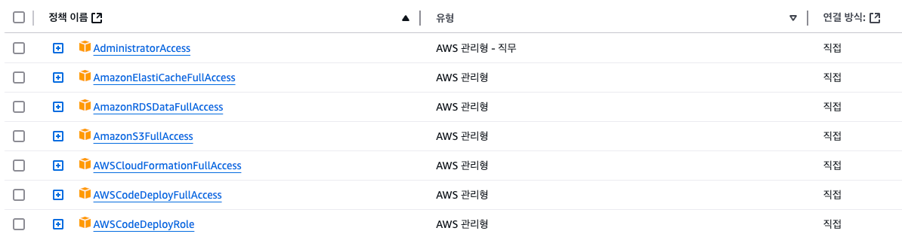

# IAM 설정
- IAM 사용자 추가후에 아래 권한을 부여한다.


# 인프라 구성
1. EC2
   1. DEV 
      - 개발 배포 환경 
   2. PROD
      - 운영 배포 환경
   3. BASTION SERVER
      
2. RDS
    - 로컬접속은 `BASTION SERVER`서버를 통해서 포트포워딩
    - 직접적인 접근 불가 
3. ELASTICACHE
    - 로컬접속은 `BASTION SERVER`서버를 통해서 포트포워딩
    - 직접적인 접근 불가
4. S3
   - GIT HUB Action으로 생성된 파일을 업로드하기 위함
5. CODE DEPLOY
   - DEV, PROD 환경에 배포 하기 위함
6. 기타
   - 배포 완료시에 각 환격에 대해서 아래와 같이 콘솔화면에 출력하도록 진행함
   ```shell
   AwsCdkStack.BucketName = nuvilab.task.bucket-dev
   AwsCdkStack.BucketUrl = http://nuvilab.task.bucket-dev.s3-website.ap-northeast-2.amazonaws.com
   AwsCdkStack.RdsEndpointAddress = awscdkstack-myrdsinstance48fd439c-uq0tsvahfjtf.cxgm6u8u0n23.ap-northeast-2.rds.amazonaws.com
   AwsCdkStack.RedisClusterEndpoint = my-redis-cluster.78lmph.0001.apn2.cache.amazonaws.com
   AwsCdkStack.bastionInstancePublicDNSName = ec2-3-38-98-55.ap-northeast-2.compute.amazonaws.com
   AwsCdkStack.devWebServerPrivateIP = 10.0.0.129
   AwsCdkStack.devWebServerPublicDNSName = ec2-52-78-153-74.ap-northeast-2.compute.amazonaws.com
   AwsCdkStack.prodWebServerPrivateIP = 10.0.0.221
   AwsCdkStack.prodWebServerPublicDNSName = ec2-3-35-156-223.ap-northeast-2.compute.amazonaws.com
   
   ```


## Useful commands

 * `mvn package`     compile and run tests
 * `cdk ls`          list all stacks in the app
 * `cdk synth`       emits the synthesized CloudFormation template
 * `cdk deploy`      deploy this stack to your default AWS account/region
 * `cdk diff`        compare deployed stack with current state
 * `cdk docs`        open CDK documentation

